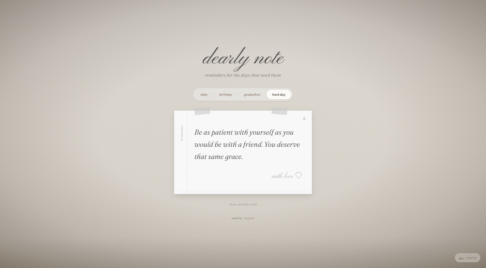

# dearly note

a quiet corner of the internet that reminds you, you matter, and your feelings are valid. dearly note serves soft words for the moments that need them most, wrapped in the feel of a handwritten note pinned to a wall.

---

## technologies

- [React](https://react.dev/) - UI
- [Vite](https://vitejs.dev/) - build tool
- [Framer Motion](https://www.framer.com/motion/) - animations
- [Tailwind CSS v4](https://tailwindcss.com/) - styling
- [html2canvas](https://html2canvas.hertzen.com/) - save note as image
- [Google Fonts](https://fonts.google.com/) - Pinyon Script, Fraunces, Outfit

---

## features

- realistic plastered wall background with noise texture, pores, and directional lighting
- handwritten note cards with tape strips, ruled lines, and a margin label
- ambient background music with a smooth fade-in on first interaction
- save any note as a PNG image
- welcome modal with a typewriter effect
- four note categories: daily, birthday, graduation, hard day
- responsive: dropdown nav on mobile, pill nav on desktop
- category-aware wall tint and light shift

---

## the process

the project started as a simple idea: a page that shows you a kind word when you need it. i built the wall background first, layering SVG noise filters, vignette shading, and a directional light spot to make it feel like a real physical space rather than a flat screen.

the note cards came next. i wanted them to feel like actual paper, tape strips holding them to the wall, faint ruled lines behind the text, a margin label written sideways like a notebook. each category has its own ink colour, accent, tape colour, and wall tint, all driven from a single `categories.js` file so nothing is duplicated.

the hardest part was the save-as-image feature. `html2canvas` captures the DOM but doesn't always render CSS the way the browser does, the vertical margin label in particular didn't export correctly because of how `writing-mode` and `transform` interact with the canvas renderer. getting it close enough took a few iterations.

background music was trickier than expected too. browsers block audio with any volume on load, so the solution was to start the audio muted and silently playing, then fade the volume in on the user's first interaction, which the welcome modal click triggers naturally.

---

## what i learned

- how browser autoplay policy actually works and the muted-first workaround
- how to layer CSS/SVG techniques to fake physical textures without any image assets
- that `html2canvas` renders a re-paint of the DOM and not a screenshot, meaning some CSS properties don't translate 1:1
- how to structure a React project with feature folders, a single constants source of truth, and custom hooks that keep components clean
- deploying to GitHub Pages with Vite's `base` config and `gh-pages`

---

## reflection

this is my first personal public React project and it means more to me than the code. i built it because i genuinely needed something like it, a quiet reminder that it's okay to not be okay. struggling with confidence is something i know well, and making something that speaks to that, however small, felt worth the effort. i'm proud of what it became.

---

## how it could be improved

- fix the `html2canvas` export so the margin label renders correctly
- let users write and save their own notes
- add more categories: grief, anxiety, celebration
- persist the last visited category in `localStorage`
- add a share button (copy link with note text as a query param)
- dark mode / night wall variant

---

## running the project

```bash
git clone https://github.com/jodyuan/dearly-note.git
cd dearly-note
npm install
npm run dev
```

to deploy:

```bash
npm run deploy
```

---

## preview



---

*made by [jodyuan](https://github.com/jodyuan)*